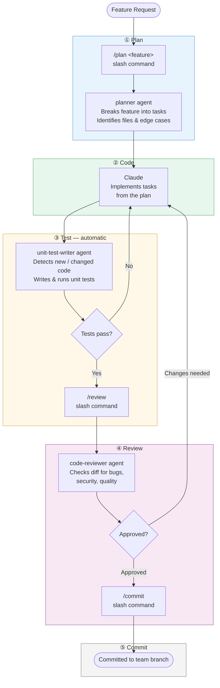

# Agentic Development Workflow

## Agents & Skills used

| Name | Type | File | Trigger |
|------|------|------|---------|
| `planner` | Agent | `.claude/agents/planner.md` | `/plan <feature>` command |
| `unit-test-writer` | Agent | `instructions/.claude/agents/unit-test-writer.md` | Proactive — auto after code |
| `code-reviewer` | Agent | `.claude/agents/code-reviewer.md` | `/review` command |
| `git-commit` | Skill (built-in) | — | `/commit` |
